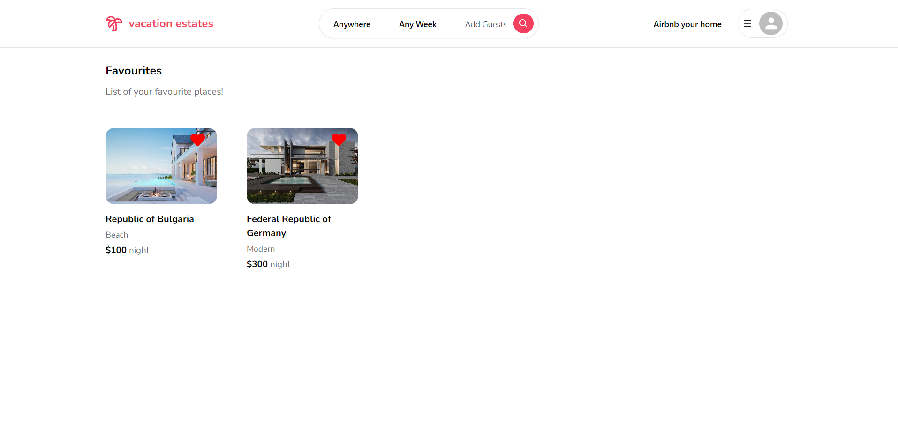

# Airbnb

WORK IN PROGRESS!

This is an Airbnb clone built with React, Vite, Tailwind CSS, MongoDB, Leaflet, Express, Cloudinary.

### Features

- **User Authentication**: Secure login and registration system.
- **Property Listings**: Search and browse available properties.
- **Map Integration**: Interactive map with Leaflet for locating properties.
- **Image Hosting**: Cloudinary integration for image uploads.
- **Real-Time Updates**: Dynamic updates using React and Vite.
- **Backend API**: Express server with MongoDB for data management.

## Live Demo

👉 [Live Demo](https://airbnb-clone-pi-khaki.vercel.app/)  
&nbsp;&nbsp;&nbsp;&nbsp;account: test@gmail.com 
&nbsp;&nbsp;&nbsp;&nbsp;password: 123456

## Screenshots

